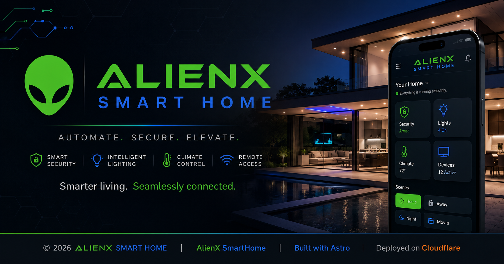

# AlienX SmartHome



AlienX SmartHome is the public-facing technology site for AlienX — a modern web engineering and interactive technology project.

The site started around smart-home technology and has evolved into a broader demonstration of what can be built with modern frontend, backend, automation, infrastructure, and browser engineering.

**Production:** https://alienxsmarthome.com

## What AlienX demonstrates

- **Web development** — responsive websites and polished interfaces
- **Web applications** — interactive, stateful browser experiences
- **Automation & integrations** — connecting systems and reducing manual work
- **Infrastructure** — deployment, networking, hosting, and operational tooling
- **Smart technology** — connected technology and home-automation experimentation
- **Interactive experiments** — browser-native interfaces designed to be explored rather than simply viewed

The website itself is the demonstration. It intentionally does not recreate a conventional smart-home dashboard or home-automation management interface.

## Technology

The project is built with:

- [Astro](https://astro.build/) — server-first web framework
- TypeScript — application logic and type safety
- CSS — responsive layout, visual effects, transitions, and interaction states
- Cloudflare Workers — production deployment and server-side functionality
- MDX — long-form content and technical stories
- Resend — transactional inquiry email delivery
- Cloudflare Turnstile — server-validated protection for the project inquiry form

## Architecture

The project uses Astro's page and component model with focused browser-side JavaScript for interactions that benefit from client-side state.

Server-side inquiry handling lives at `/api/inquiry` and includes validation, honeypot protection, Turnstile verification, and email delivery through Resend.

Sensitive credentials are kept outside the repository as Cloudflare Worker secrets. They should never be committed to source control.

## Project structure

```text
src/
├── components/       Shared interface components
├── content/blog/     Markdown and MDX content
├── layouts/          Page and article layouts
├── pages/            Routes and server endpoints
├── styles/           Global styling and design tokens
└── consts.ts         Site-wide metadata and content constants

public/               Static assets and site metadata
wrangler.json         Cloudflare Workers configuration
astro.config.mjs      Astro configuration
package.json          Dependencies and development commands
```

## Local development

Requirements:

- Node.js 22 or newer
- npm

Install dependencies:

```bash
npm install
```

Start the Astro development server:

```bash
npm run dev
```

Build the production site:

```bash
npm run build
```

Run the full project check:

```bash
npm run check
```

Preview the Cloudflare Workers build locally:

```bash
npm run preview
```

Deploy to Cloudflare Workers:

```bash
npm run deploy
```

## Contact protection

The project inquiry form uses Cloudflare Turnstile in addition to server-side validation and a honeypot field.

The public Turnstile site key may be present in the frontend source. The corresponding secret must remain a Cloudflare Worker secret under the name:

```text
TURNSTILE_SECRET
```

The Worker also uses the `TURNSTILE_HOSTNAMES` environment variable to restrict successful verification to the site's approved production hostnames.

## SEO and social metadata

The site includes:

- Canonical URLs
- Open Graph metadata
- Twitter/X large-image metadata
- Structured data for the site and articles
- XML sitemap support
- `robots.txt`
- A branded 1200×630 social preview image

## Design direction

AlienX uses a mixed visual system rather than a single-color interface:

- **Blue** provides the primary interface and structural accent
- **Green** identifies AlienX branding, active states, system/core visuals, and important calls to action
- **Neutral dark and light surfaces** provide hierarchy and readable content

The design favors interaction, motion, browser-native effects, and inspectable frontend techniques while retaining responsive and reduced-motion behavior.

## Status

This is an actively evolving project. Some work and portfolio content currently serves as demonstration material and will be replaced or expanded with real projects and technical stories over time.

## License

No open-source license is currently declared. Unless otherwise stated, the source and original project assets remain the property of AlienX.
