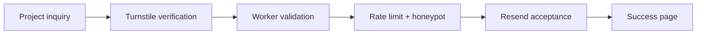

<div align="center">

<a href="https://alienxsmarthome.com">
  
</a>

<br /><br />

[](https://alienxsmarthome.com)
[](https://alienxsmarthome.com/contact)

[](https://github.com/AlienX420710/alienx-smarthome/actions/workflows/quality.yml)
[](https://github.com/AlienX420710/alienx-smarthome/actions/workflows/production-smoke.yml)
[](https://github.com/AlienX420710/alienx-smarthome/actions/workflows/responsive.yml)
[](https://astro.build)
[](https://workers.cloudflare.com)

### Technology built to do something.

A public-facing technology showcase for **web engineering, automation, infrastructure, and interactive browser experiences.**

[Work](https://alienxsmarthome.com/work) · [Experience](https://alienxsmarthome.com/experience) · [Technology](https://alienxsmarthome.com/technology) · [Status](https://alienxsmarthome.com/status) · [About](https://alienxsmarthome.com/about) · [Start a Project](https://alienxsmarthome.com/contact)

</div>

---

## Welcome

AlienX SmartHome is a production web project built to demonstrate what modern frontend engineering, backend services, deployment infrastructure, automation, and browser-native interaction can look like when the website itself is part of the proof.

The project started around smart-home technology and expanded into a broader engineering showcase. It is intentionally **not** a conventional Home Assistant dashboard or home-automation management interface.

<table>
<tr>
<td width="50%" valign="top">

### What it showcases

- Responsive web interfaces
- Interactive browser experiences
- Automation and system integrations
- Cloud infrastructure and deployment
- Secure project inquiry handling
- Performance, accessibility, and reduced-motion behavior

</td>
<td width="50%" valign="top">

### Built for production

- Cloudflare Workers deployment
- Turnstile-protected inquiry API
- Server-side validation and rate limiting
- Resend-backed email delivery
- Production health monitoring
- Automated responsive compatibility checks

</td>
</tr>
</table>

## Website preview

<div align="center">
  <a href="https://alienxsmarthome.com">
    
  </a>
  <br />
  <sub>Select the preview to visit the production website.</sub>
</div>

## What is inside

| Area | Purpose |
| :--- | :--- |
| **Work** | Selected engineering work and project outcomes |
| **Experience** | Interactive browser experiments and visual systems |
| **Technology** | The stack, engineering disciplines, and implementation approach |
| **Status** | Public-facing production service health and runtime signals |
| **About** | The story, principles, and direction behind AlienX |
| **Start a Project** | Secure project inquiry flow for new work |

> The site favors real implementation over simulated dashboards, fake metrics, or decorative claims.

## Contact flow



The success state is reached only after the production email provider accepts the inquiry. Validation and delivery failures remain on the form instead of reporting a false success.

## Security and reliability

The production application uses multiple independent controls around its public inquiry surface:

- Cloudflare Turnstile token and hostname verification
- Same-origin submission enforcement
- Honeypot spam detection
- Per-IP rate limiting
- Field allowlists and length limits
- Actual request-body size enforcement
- Resend response-ID confirmation
- Production security headers
- Dependency auditing
- Automated production smoke checks
- Responsive viewport compatibility testing

Security reports should be submitted privately according to the [security policy](./SECURITY.md) or emailed to **alienx@alienxsmarthome.com**.

## Design system

AlienX uses a restrained dark interface with controlled blue and green accents rather than treating every page as a separate visual system.

| Accent | Role |
| :--- | :--- |
| **Blue** | Primary interface structure, navigation, and technical emphasis |
| **Green** | AlienX identity, active states, system/core visuals, and key actions |
| **Dark neutrals** | Contrast, depth, panels, and content hierarchy |
| **Motion** | Interaction feedback and browser-native experimentation |

Responsive behavior, keyboard focus states, and reduced-motion preferences are treated as part of the design rather than afterthoughts.

## Technology

| Layer | Technology | Purpose |
| :--- | :--- | :--- |
| Framework | [Astro 7.3.1](https://astro.build) | Pages, routing, rendering, and site composition |
| Language | TypeScript 5.9.3 | Application logic and type safety |
| Runtime | [Cloudflare Workers](https://workers.cloudflare.com) | Production hosting and server-side functionality |
| Protection | [Cloudflare Turnstile](https://www.cloudflare.com/products/turnstile/) | Server-validated bot protection |
| Email | [Resend](https://resend.com) | Project inquiry notification delivery |
| Validation | GitHub Actions | Build, type, audit, smoke, and responsive quality gates |

The production build also uses Cloudflare Images for image processing, Cloudflare KV for sessions, Astro Sitemap for discovery, and focused client-side JavaScript where browser state or interaction requires it.

## Automated checks

| Check | When it runs | What it protects |
| :--- | :--- | :--- |
| **Quality** | Every push and pull request to `main` | Install, build, TypeScript, Worker dry run, and dependency audit |
| **Production Smoke** | Every push to `main` and hourly | Both production hostnames, HTML response, `/api/status`, and known Worker failure regression |
| **Responsive Compatibility** | Every push and pull request to `main` | 84 viewport/page combinations for overflow and runtime regressions |

Only **`main`** is maintained and deployed to production.

## Project map

```text
/
├── .github/
│   └── workflows/                Quality, smoke, and responsive checks
├── public/                       Static assets, fonts, icons, and browser scripts
├── src/
│   ├── components/               Shared interface components
│   ├── layouts/                  Shared page structure and metadata
│   ├── pages/                    Routes and server endpoints
│   ├── styles/                   Global styling and design tokens
│   ├── icons/                    Site icon components
│   └── consts.ts                 Site-wide metadata and content constants
├── astro.config.mjs              Astro configuration
├── wrangler.json                 Cloudflare Workers configuration
├── package.json                  Dependencies and development commands
├── package-lock.json             Locked dependency tree
└── SECURITY.md                   Private vulnerability reporting policy
```

## Local development

The project requires **Node.js 22 or newer** and npm.

```bash
npm ci
npm run dev
```

Then open `http://localhost:4321`.

| Command | Purpose |
| :--- | :--- |
| `npm run dev` | Start the Astro development server |
| `npm run build` | Create the production build |
| `npm run check` | Build, type-check, and validate a Cloudflare deployment bundle |
| `npm run audit` | Check dependencies for high-severity vulnerabilities |
| `npm run preview` | Build and preview through the Cloudflare runtime |
| `npm run deploy` | Deploy the current release through Wrangler |

## Production

The public site is available at:

**https://alienxsmarthome.com**

The production Worker serves both the apex and `www` hostnames. GitHub Actions continuously verifies the deployed experience rather than treating a successful build as the only definition of a healthy release.

---

<div align="center">


### AlienX SmartHome

*The website is part of the proof.*

[Website](https://alienxsmarthome.com) · [Work](https://alienxsmarthome.com/work) · [Technology](https://alienxsmarthome.com/technology) · [Start a Project](https://alienxsmarthome.com/contact)

<sub>Modern web engineering · automation · infrastructure · interactive technology</sub>

</div>
