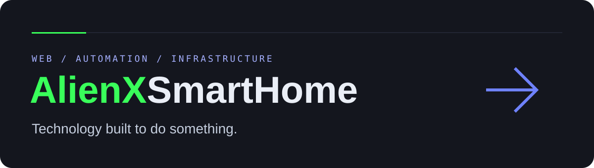

<div align="center">

<a href="https://alienxsmarthome.com"></a>

[Live website](https://alienxsmarthome.com) · [Explore the museum](https://alienxsmarthome.com/experience/) · [Start a project](https://alienxsmarthome.com/contact/)

[](https://github.com/AlienX420710/alienx-smarthome/actions/workflows/quality.yml)
[](https://github.com/AlienX420710/alienx-smarthome/actions/workflows/production-smoke.yml)
[](https://github.com/AlienX420710/alienx-smarthome/actions/workflows/responsive.yml)
[](https://github.com/AlienX420710/alienx-smarthome/actions/workflows/accessibility.yml)
[](https://astro.build)
[](https://workers.cloudflare.com)

Web engineering, automation, infrastructure, and interactive browser experiences.

</div>

## What this project is

AlienX SmartHome is an engineering showcase, not a Home Assistant dashboard or a home-control application. The site combines browser experiments, an interactive stack explanation, a public configuration-status endpoint, and a protected project inquiry form.

Only **`main`** is maintained and deployed. Start with the Codex-maintained [project state and findings register](docs/project-state.md); assistants must also read [AGENTS.md](AGENTS.md). [Audit progress](docs/audit-remediation.md) records repair history. The [release runbook](docs/release-runbook.md) covers acceptance checks, incident triage, and rollback.

`npm run deploy` now checks five required CI workflows for the exact current main
revision before invoking Wrangler. Cloudflare must use this deploy command for
the gate to apply; the account-level setting still needs operator confirmation.

| Area         | Current implementation                                                                                  |
| :----------- | :------------------------------------------------------------------------------------------------------ |
| Experience   | Seven browser exhibits with keyboard controls and motion preferences                                    |
| Technology   | Interactive architecture layers and implementation explanations                                         |
| Status       | Worker reachability, integration configuration, and deployed Git revision—not an email-delivery monitor |
| Contact      | Validated, Turnstile-protected inquiry submission with retry recovery                                   |
| Work / About | Placeholder content awaiting genuine case studies and owner biography                                   |

## Inquiry handling

Requests pass origin/content-type/body-size checks, honeypot and rate controls, Turnstile verification, and field validation before contacting Resend. The endpoint requires server-owned verification state; direct calls cannot skip middleware protection.

- Turnstile tokens are checked for hostname and the `contact` action.
- Requests have bounded sizes and timeouts. Failed submissions preserve entered values and refresh verification.
- Unchanged retries retain a payload-bound idempotency key. Resend retains idempotency records for 24 hours.
- Edge rate counters are shared within each Cloudflare location, not a strict global quota. A bounded isolate-local limit supplements them.
- Success requires provider acceptance with an email ID. **Acceptance is not proof of inbox delivery.** Visiting the noindex follow-up page directly is not a receipt.
- Browser and API regression tests mock verification/email delivery; they send no email.

Security headers include a response-level frame-ancestor policy and an Astro-generated script CSP. Never put provider secrets in browser code or commit local credentials. Report vulnerabilities through [SECURITY.md](SECURITY.md).

## Design and accessibility

The existing identity stays blue, green, and neutral. These values describe the shared foundation; page-specific systems retain scoped tokens.

| Token / role           | Light                                                                     | Dark      |
| :--------------------- | :------------------------------------------------------------------------ | :-------- |
| Primary accent         | `#2563EB`                                                                 | `#6F82FF` |
| Accent interaction     | `#1D4ED8`                                                                 | `#A5B0FF` |
| Shared page background | `#FFFFFF`                                                                 | `#14161E` |
| Shared body text       | `#222939`                                                                 | `#DCE0E8` |
| Identity green         | `#39FF5A` decorative accent; darker variants for small light-surface text | `#39FF5A` |

Body type is locally hosted **Atkinson**, regular and bold. Technical readouts use system monospace fonts. Neon accents are not blanket approval for text contrast.

System, explicit light, and explicit dark themes are supported. Saved choices must win over OS preferences before paint and after navigation. Focus visibility, skip navigation, modal focus containment, keyboard alternatives, and reduced-motion behavior are tested requirements—not a claim of complete assistive-technology certification.

## Stack and source ownership

Astro, TypeScript, Cloudflare Workers, Turnstile, and Resend power the application. Cloudflare Images and KV support the adapter. Exact application and test-tool versions are pinned in [package.json](package.json) and the committed lockfile.

| Path                 | Responsibility                                                          |
| :------------------- | :---------------------------------------------------------------------- |
| `src/pages/`         | Page documents and API endpoints                                        |
| `src/components/`    | Navigation, metadata, dialogs, and shared controls                      |
| `src/lib/`           | Shared runtime response validation                                      |
| `src/styles/`        | Shared foundation and theme styles                                      |
| `public/`            | Visitor assets, fonts, and lifecycle-managed browser scripts            |
| `tests/`             | Mocked API, preference, browser, and Safari regressions                 |
| `scripts/`           | Image validation/optimization, Lighthouse, type scoping, release checks |
| `docs/`              | Audit evidence, operations, and README-only artwork                     |
| `.github/workflows/` | Local-build quality gates and production monitoring                     |

There is no shared `src/layouts/` directory. Some legacy page overrides remain in BaseHead/global styles; formatting makes them reviewable but does not eliminate that ownership debt. Original social artwork is preserved; the build generates a smaller WebP and decodes public raster images to detect corruption.

## Automated checks

| Workflow              | When                                 | Scope                                                                                           |
| :-------------------- | :----------------------------------- | :---------------------------------------------------------------------------------------------- |
| Quality               | Push / PR to main                    | Clean install, formatting, API tests, build, Astro/TypeScript, Worker dry run, dependency audit |
| Responsive            | Push / PR; manual                    | Built local preview: 84 route/viewport combinations plus interaction regressions                |
| Accessibility & Theme | Push / PR; manual                    | Built local preview: 48 route/theme/OS cases, axe WCAG checks, Lighthouse accessibility ≥95     |
| Lighthouse            | Push / PR; manual                    | Built local preview: accessibility, best practices, SEO ≥95; performance ≥85                    |
| Safari                | Push / PR; manual                    | Built local preview in actual macOS Safari WebDriver                                            |
| Production Integrity  | Push / PR, six-hour schedule; manual | Live host security headers, redirects, and SEO                                                  |
| Production Smoke      | Push, hourly; manual                 | Live host/API health; pushes also require the exact Git revision                                |

GitHub CodeQL is separate security analysis. Cloudflare Builds is a separate deployment integration: neither a passing CodeQL run nor a healthy old deployment proves a new release succeeded. Independent deployment gating and notification recipients still require account-owner configuration. See the runbook before declaring a release accepted.

## Local setup

Use **Node 22.19+** (or a newer supported LTS) and npm. CI uses Node 22; verify lockfile changes with a clean install, not only an existing `node_modules` tree.

```bash
npm ci
npm run dev
```

Open [localhost:4321](http://localhost:4321). Static pages and mocked tests need no live provider secrets. Without local bindings, `/api/status` intentionally reports degraded configuration with HTTP 503.

For an explicitly approved real integration test, copy `.dev.vars.example` to `.dev.vars` and `.env.example` to `.env`. Supply dedicated test credentials and a matching public `PUBLIC_TURNSTILE_SITE_KEY`, then configure the hostname policy consistently. The public key is injected at build time; an empty value preserves the existing production widget. Never put secrets in `PUBLIC_*` variables or use production mail credentials for automated tests. Cloudflare production secrets are `TURNSTILE_SECRET` and `RESEND_API_KEY`; `TURNSTILE_HOSTNAMES` is a non-secret Worker variable.

| Command                                   | Purpose                                                       |
| :---------------------------------------- | :------------------------------------------------------------ |
| `npm run dev`                             | Generate optimized assets and start Astro                     |
| `npm test`                                | Mocked handlers, status contracts, and preference regressions |
| `npm run typecheck`                       | Astro diagnostics and TypeScript                              |
| `npm run build`                           | Validate/optimize images and build the Worker site            |
| `npm run check`                           | Tests, type checks, build, and Worker deploy dry run          |
| `npm run audit`                           | Audit the full dependency tree, including test tools          |
| `npm run preview`                         | Build and start the local Cloudflare runtime                  |
| `npm run test:browser`                    | Responsive and interactive Chromium checks                    |
| `npm run test:a11y`                       | Theme/OS and accessibility matrix                             |
| `npm run test:lighthouse`                 | Existing Lighthouse score gates against local preview         |
| `npm run format` / `npm run format:check` | Format maintained source / check formatting                   |
| `npm run cf-typegen`                      | Regenerate and scope Worker declarations                      |
| `npm run deploy`                          | Deploy through configured Wrangler; follow the runbook first  |

Browser checks require a running preview on port 4321:

```bash
npx playwright install chromium
npm run preview
# In another terminal:
npm run test:browser
npm run test:a11y
```

Lighthouse needs Chrome/Chromium. `node tests/safari.cjs` needs macOS and enabled Safari WebDriver. Browser tests do not replace physical-device, screen-reader, or actual provider-delivery verification.
