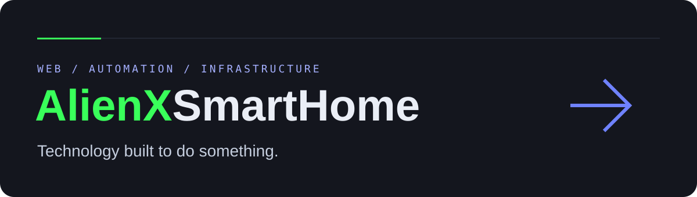

# AlienX SmartHome



<p align="center">
  <a href="https://alienxsmarthome.com"></a>
  <a href="https://alienxsmarthome.com/contact/"></a>
</p>

<p align="center">
  <a href="https://github.com/AlienX420710/alienx-smarthome/actions/workflows/quality.yml"></a>
  <a href="https://github.com/AlienX420710/alienx-smarthome/actions/workflows/production-smoke.yml"></a>
  <a href="https://github.com/AlienX420710/alienx-smarthome/actions/workflows/responsive.yml"></a>
  <a href="https://github.com/AlienX420710/alienx-smarthome/actions/workflows/accessibility.yml"></a>
  <a href="https://github.com/AlienX420710/alienx-smarthome/actions/workflows/safari.yml"></a>
  <a href="https://github.com/AlienX420710/alienx-smarthome/actions/workflows/lighthouse.yml"></a>
  <a href="https://github.com/AlienX420710/alienx-smarthome/actions/workflows/production-integrity.yml"></a>
  <a href="https://github.com/AlienX420710/alienx-smarthome/blob/main/package.json"></a>
  <a href="https://developers.cloudflare.com/workers/"></a>
</p>

[alienxsmarthome.com](https://alienxsmarthome.com) · [Current state](docs/project-state.md) ·
[Quality](QUALITY.md) · [Security reporting](SECURITY.md)

Technology showcase and automation portfolio; no invented clients or results.

## Maintainer map

| Need                                           | Read                                                                               |
| ---------------------------------------------- | ---------------------------------------------------------------------------------- |
| Findings, blockers and dated release evidence  | [Project state](docs/project-state.md)                                             |
| Architecture and request guarantees            | [Architecture](docs/ai-context.md)                                                 |
| Release, recovery, email and device procedures | [Operations](docs/release-runbook.md)                                              |
| Assistant working rules                        | [AGENTS.md](AGENTS.md)                                                             |
| Cross-project coordination                     | [Local working agreement](AGENTS.md#cross-project-coordination); linked issues/PRs |
| Prior audits and comparisons                   | [Pinned history](docs/project-state.md#historical-evidence-and-consolidation-map)  |

## Development

Node >=22, npm and committed lockfile. Versions live in package.json.

```bash
npm ci
npm run dev
```

Local validation: npm run format:check, npm run check and npm run audit. Browser
suites and production verification are separate; follow operations. Never deploy
with a direct Wrangler command that bypasses the gate.

Astro/TypeScript runs on Cloudflare Workers, using Turnstile and Resend. src owns
the app; public serves assets; scripts/tests own verification; .github owns CI.
docs/brand artwork remains where needed for builds; licenses stay beside fonts.
Secrets belong in provider stores or ignored local Worker bindings, never the repo.
Form success means provider acceptance, not inbox delivery. Mocked tests send no
email. Read the local contract before changing validation, recipients or retries.
Shared lessons do not substitute for independent project acceptance.
